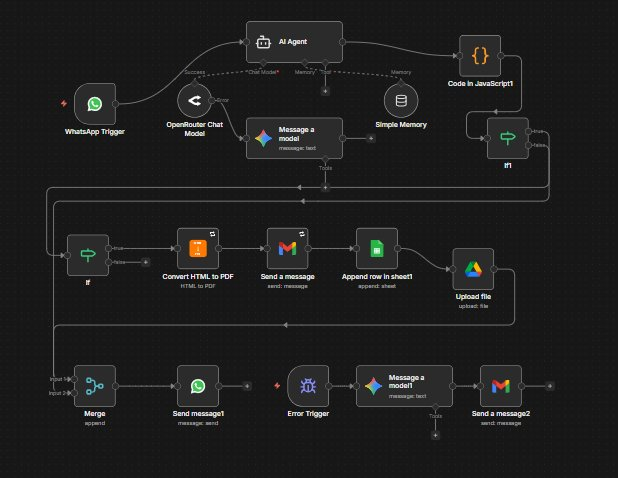

# 🚚 AI-Powered Freight Documentation Automation System

An intelligent, end-to-end logistics automation solution built with **n8n** that uses WhatsApp as a conversational interface to collect shipment data, generate professional PDF manifests, and distribute them — with full error resilience and observability.

---

## 📋 Table of Contents

- [Overview](#overview)
- [Features](#features)
- [Architecture](#architecture)
- [Tech Stack](#tech-stack)
- [Workflow Breakdown](#workflow-breakdown)
- [Error Handling](#error-handling)
- [Setup & Configuration](#setup--configuration)
- [Environment Variables](#environment-variables)
- [Project Learnings](#project-learnings)

---

## Overview

This system eliminates manual freight documentation by replacing traditional data-entry workflows with an AI-driven conversational pipeline. Users interact with a WhatsApp chatbot to provide shipment details in natural language. The AI extracts, validates, and structures this data before automatically generating and distributing professional freight manifests.

The result is a scalable, error-resilient logistics automation pipeline that reduces manual processing time, minimizes data-entry errors, and improves operational efficiency.

---

## Features

- 💬 **WhatsApp Conversational Interface** — Users submit shipment data through natural, multi-turn WhatsApp conversations
- 🤖 **AI Agent with Memory** — Powered by Gemini Flash (via OpenRouter) with contextual memory for intelligent, stateful data extraction
- ✅ **Validation Guardrails** — JavaScript sanitization and conditional routing ensure only verified data proceeds to document generation
- 📄 **Dynamic PDF Manifest Generation** — Professional freight manifests generated on-the-fly from structured shipment data
- 📧 **Automated Email Distribution** — Completed manifests delivered via Gmail automatically
- 📊 **Google Sheets Logging** — Structured shipment records logged for tracking and reporting
- 🗂️ **Google Drive Archiving** — Files saved with organized, consistent naming conventions
- 🔀 **Merge Logic** — Consistent workflow termination regardless of conditional routing path taken
- 🚨 **Global Error Handling** — Automated developer alerts and AI-assisted debugging for production resilience

---

## Architecture

```
WhatsApp Message
       │
       ▼
  n8n Webhook
       │
       ▼
  AI Agent (Gemini Flash via OpenRouter)
  ├── Conversational Memory
  └── Multi-turn Data Extraction
       │
       ▼
  JS Sanitization & Validation
       │
       ├── [Valid] ──────────────────────────────┐
       │                                         ▼
       │                              PDF Manifest Generation
       │                                         │
       │                         ┌───────────────┼───────────────┐
       │                         ▼               ▼               ▼
       │                     Gmail Send    Sheets Log    Drive Archive
       │                         │               │               │
       └── [Invalid] ──────── Merge Node ────────┴───────────────┘
                                 │
                                 ▼
                         WhatsApp Reply
```

### n8n Workflow — Live Canvas



> The actual n8n workflow canvas showing the full automation pipeline: WhatsApp trigger → AI Agent (OpenRouter/Gemini Flash) with Simple Memory → JavaScript validation → conditional routing → HTML to PDF conversion → Gmail, Google Sheets, Google Drive → Merge node → WhatsApp reply, with a separate Error Trigger branch for AI-assisted debugging.

---

## Tech Stack

| Layer | Technology |
|---|---|
| Workflow Orchestration | [n8n](https://n8n.io/) |
| AI Model | Gemini Flash (via OpenRouter) |
| Conversational Interface | WhatsApp Business API |
| Document Generation | PDF (dynamic templating) |
| Email Distribution | Gmail API |
| Data Logging | Google Sheets API |
| File Archiving | Google Drive API |
| Scripting / Validation | JavaScript (n8n Code nodes) |
| Error Alerting | n8n Error Workflow + AI-assisted debugging |

---

## Workflow Breakdown

### 1. WhatsApp Entry Point
Incoming WhatsApp messages are received via webhook and routed to the AI Agent. The agent maintains conversation context across multiple messages, prompting users for any missing shipment details.

### 2. AI Data Extraction
The AI Agent (Gemini Flash) interprets free-form user input and extracts structured shipment fields such as origin, destination, cargo type, weight, consignee details, and shipment date.

### 3. Validation & Sanitization
A JavaScript Code node sanitizes and validates the AI's extracted output. A conditional (IF/Switch) node routes the flow — only complete, valid data proceeds to document generation. Invalid or incomplete data triggers a clarification reply back to the user via WhatsApp.

### 4. PDF Manifest Generation
A professional freight manifest PDF is dynamically generated using the validated shipment data, including all relevant fields, formatted for logistics operations.

### 5. Distribution & Storage
In parallel:
- The manifest is **emailed** to the relevant stakeholders via Gmail
- A structured record is **logged** in Google Sheets
- The PDF is **archived** in Google Drive under an organized naming convention (e.g., `MANIFEST_[DATE]_[SHIPMENT_ID].pdf`)

### 6. Merge & Termination
A Merge node consolidates both the valid and invalid routing paths, ensuring the workflow always terminates cleanly with a response sent back to the WhatsApp user.

---

## Error Handling

The system includes a **global error-handling workflow** in n8n that:

- Catches failures at any node in the pipeline
- Sends **automated alerts** to the developer (via email or messaging)
- Includes **AI-assisted error diagnostics** — a secondary AI call analyzes the error context and suggests likely causes and fixes
- Ensures no silent failures in production

---

## Setup & Configuration

### Prerequisites

- n8n instance (self-hosted or cloud)
- OpenRouter API account with Gemini Flash access
- WhatsApp Business API credentials
- Google Cloud project with Sheets, Drive, and Gmail APIs enabled
- Gmail OAuth2 credentials

### Installation

1. **Clone or import the workflow** into your n8n instance.

2. **Configure credentials** in n8n for:
   - OpenRouter (HTTP Header Auth)
   - WhatsApp Business API
   - Google OAuth2 (Sheets, Drive, Gmail)

3. **Set environment variables** (see below).

4. **Activate the workflow** and point your WhatsApp webhook to the n8n trigger URL.

5. **Configure the error workflow** and link it to the main workflow under *Workflow Settings → Error Workflow*.

---

## Environment Variables

| Variable | Description |
|---|---|
| `OPENROUTER_API_KEY` | Your OpenRouter API key for Gemini Flash access |
| `WHATSAPP_TOKEN` | WhatsApp Business API access token |
| `WHATSAPP_PHONE_ID` | WhatsApp sender phone number ID |
| `GOOGLE_CLIENT_ID` | Google OAuth2 client ID |
| `GOOGLE_CLIENT_SECRET` | Google OAuth2 client secret |
| `SHEETS_SPREADSHEET_ID` | Target Google Sheets document ID |
| `DRIVE_FOLDER_ID` | Target Google Drive folder ID for archive |
| `ALERT_EMAIL` | Developer email address for error alerts |

---

## Project Learnings

Building this system provided hands-on experience across several key areas:

- **AI Orchestration** — Designing multi-turn agent conversations with memory and structured output extraction
- **Workflow Architecture** — Building conditional, branching automation pipelines with consistent termination via merge logic
- **Data Validation** — Implementing guardrails to sanitize AI outputs before they reach downstream systems
- **API Integrations** — Connecting WhatsApp, Gmail, Google Sheets, Google Drive, and OpenRouter in a unified pipeline
- **Document Generation** — Dynamically generating professional PDFs from structured data at runtime
- **Observability & Resilience** — Building global error handling with automated alerting and AI-assisted debugging for production stability

---

## Impact

This system transforms a traditionally manual, error-prone freight documentation process into a fully automated, AI-driven pipeline — reducing processing time, eliminating data-entry errors, and providing a seamless experience for logistics operators through a familiar interface (WhatsApp).

---

*Built with n8n · Powered by Gemini Flash · Designed for scalable logistics automation*
